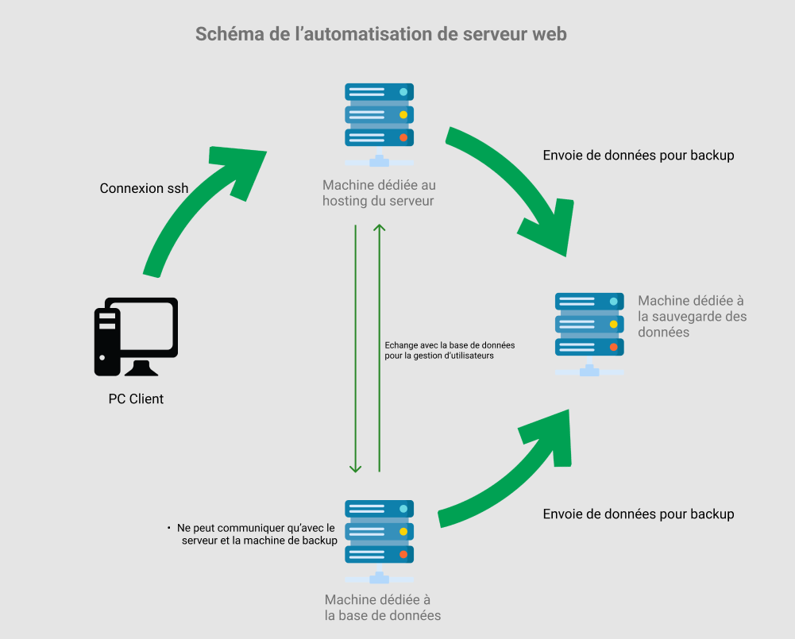

Monitoring
===

L'outils utilisé est netdata et il est accessible sur http://"nomdedomaine":19999

Netdata permet de surveiller l'état de la RAM, du CPU, du disque et de beaucoup d'autres éléments de la machine.  
On a paramétré netdata pour recevoir des notifications sur un serveur Discord si jamais un problème survenait.

Backup
===

## Ci-dessous la liste des fichiers que l'on sauvegarde:

Les dossiers de log comme celui de nginx "var/log/nginx".

Les dossiers de configuration.

La base de données utilisée est entièrement sauvegardée.

---

Schéma de la solution
===

